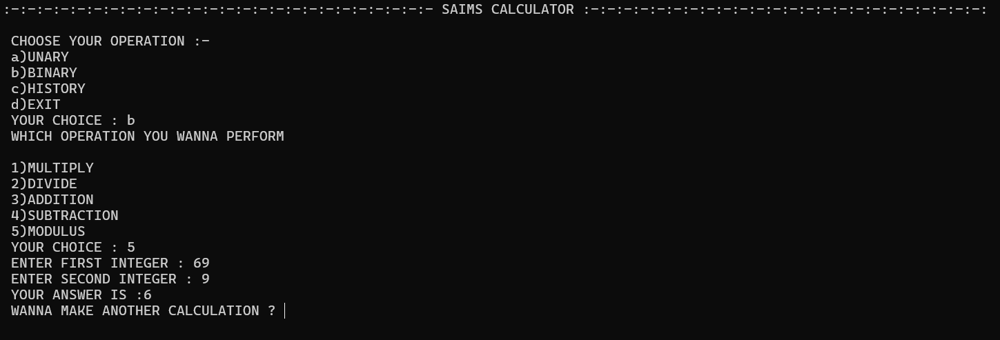

# 🧮 CLI Based Calculator (C++)

A console-based **Calculator in C++** that supports both unary (increment, decrement) and binary operations (addition, subtraction, multiplication, division, modulus). It also maintains a history of all operations with their results for easy reference.

---

## ✨ Features

* **Unary Operations**

  * Increment
  * Decrement

* **Binary Operations**

  * Addition
  * Subtraction
  * Multiplication
  * Division
  * Modulus

* **History Tracker** – View a log of operations with their answers

* **Menu-Driven System** – Simple navigation for smooth user experience

* **Error Handling** – Prompts on wrong inputs

---

## 🛠️ Technologies Used

**Language:**
C++

**Libraries:**

* `<iostream>` – Input/output
* `<iomanip>` – Formatted display
* `<string>` – For history storage

---

## 🚀 How to Run

1. Clone the repository:

   ```bash
   git clone https://github.com/your-username/CLI_Calculator.git
   cd CLI_Calculator
   ```

2. Compile the program:

   ```bash
   g++ main.cpp -o CLI_Calculator
   ```

3. Run the executable:

   ```bash
   ./CLI_Calculator
   ```

---

## 📸 Sample Output

```
::::::::::::::::::::::::::::::::::::::::::::::::::::::: SAIMS CALCULATOR :::::::::::::::::::::::::::::::::::::::::::::::

 CHOOSE YOUR OPERATION :-
 a) UNARY
 b) BINARY
 c) HISTORY
 d) EXIT
```

---

## 🖼️ Screenshots / Preview



---

## 📚 Learning Outcomes

This project helps beginners practice:

* Arrays and strings in C++
* Menu-driven programming
* Input validation and error handling
* Operation history tracking

---

## 👨‍💻 Author

Developed by **Bilal Asif**

---
